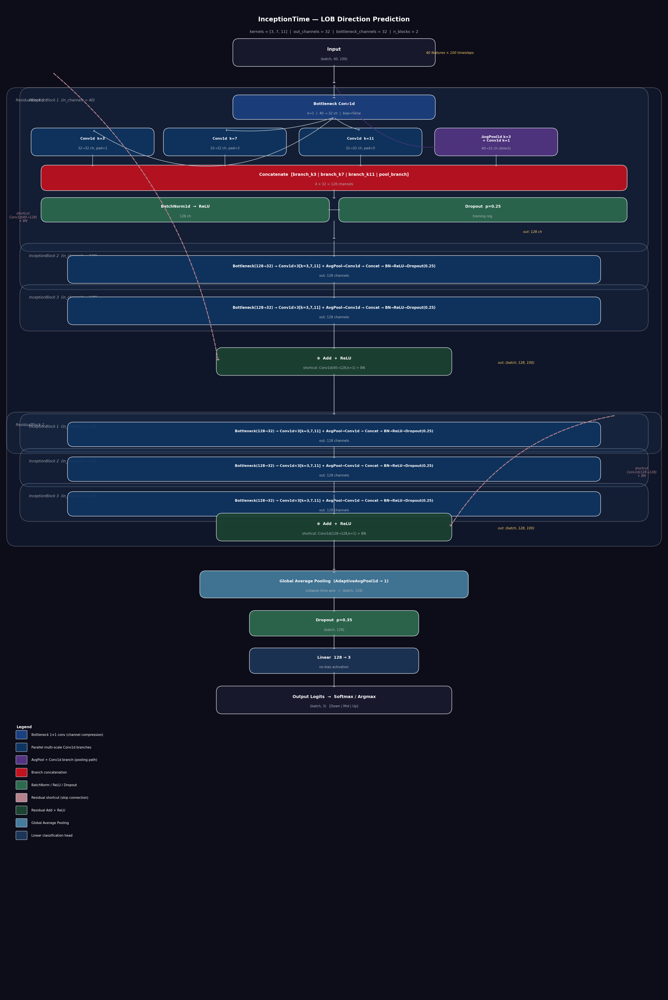

# High Frequency Trading - InceptionTime (Convolutional Neural Networks)

A 3-class classification task that uses a variant of the **"InceptionTime"** Convolutional Neural Network architecture to predict short-term directional movements in mid price based on raw-LOB data.

# Project Overview

In this project we adapt the **"InceptionTime"** CNN architecture and apply it to the task of directional classification in a high frequency trading environment, using the FI-2010 dataset. The **"InceptionTime"** architecture was proposed in the 2019 paper “InceptionTime: Finding AlexNet for Time Series Classification.”. The architecture applies convolutions at several receptive field sizes simultaneously to look for short, medium, and long term patterns in a time series. Unlike many traditional time-series methods this allows it to identify multiple temporal structures that a single-scale window would miss.

The main architectural changes we make are adding dropout layers after every inception block and at the head, which helps regularize and prevent overfitting considering the noisiness of LOB data and the relatively small dataset (362,401 rows of training data across 9 days), and reducing the number of inception blocks from 5 to 3 which improves the models ability to generalise given the dataset size and the signal to noise ratio of LOB data, consistent with the generalisation literature on deep networks in small-data regimes. This architectural change also allows training to run significantly faster.

# Model Architecture

  

## Input
We have out input as a 3D tensor, it is a batch of LOB snapshots (we use batches of 64 for training and 128 for evaluation) where 40 is the feature dimension (10 price/volume levels × bid & ask × 2) and 100 is the temporal sequence length. The temporal axis is what the convolutions slide over.

## ResidualBlock (×2)

We use a structure  that wraps three InceptionBlocks inside a residual skip connection. The shortcut is a 1D CNN with kernel size 1 and a batch normalisation layer, this projects the input to match the output channel count. We then add them elementwise to the output of the third InceptionBlock before a final ReLU activation. This stabilises gradients and lets the model learn identity mappings if deeper processing isn't useful.

## InceptionBlock

#### Bottleneck 

We use a 1D CNN with a kernel size of 1 that compresses the channel dimension before we move to the expensive multi-scale convolutions. This reduces compute cost and mixes the cross-channel information.

#### Three parallel Conv1d branches

We use 3 parallel 1-D CNN branches to process the bottleneck output each branch with a different kernel size, to capture temporal dependencies at different scales. The first kernel size we use is 3 to pick up on local micro-structure patterns, and then the other branches use kernels of sizes 7 and 11 to pick up progressively longer patterns. We set padding to k//2 where k is the kernel size.

#### Average Pooling and 1D-CNN branch 

We use an average pooling layer with kernel size 3 and stride length 1, followed by a 1D CNN (with kernel size 1) which is applied directly to the pre-bottleneck input. This captures smoothed, local temporal aggregations and can act as a mild regulariser.

#### Concatenate
We then concatenate the outputs of the four branch along the channel axis. The resulting tensor has 128 channels and the same temporal length (100).

#### Batch Normalisation → ReLU → Dropout(p=0.25)
We then use batch normalisation followed by ReLU activation and set dropout at 0.25 in order to regularise and force the model to learn high-signal features. This is applied within each block.

## Global Average Pooling
We then averages across the entire temporal axis, which collapses the 100-timestep dimension into a single vector per sample so that the model learns a temporal summary of the LOB dynamics.

## Classification Head
We set a slightly heavier dropout (p=0.35) before the final linear layer, which projects the data to three logits corresponding to the three LOB mid-price movement classes (Down / Stationary / Up).

## Results Summary

  

  

